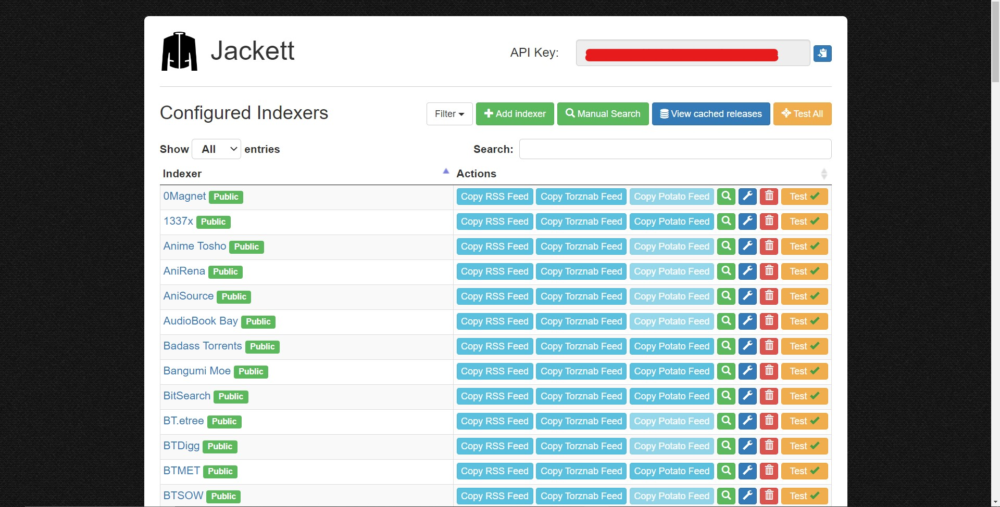
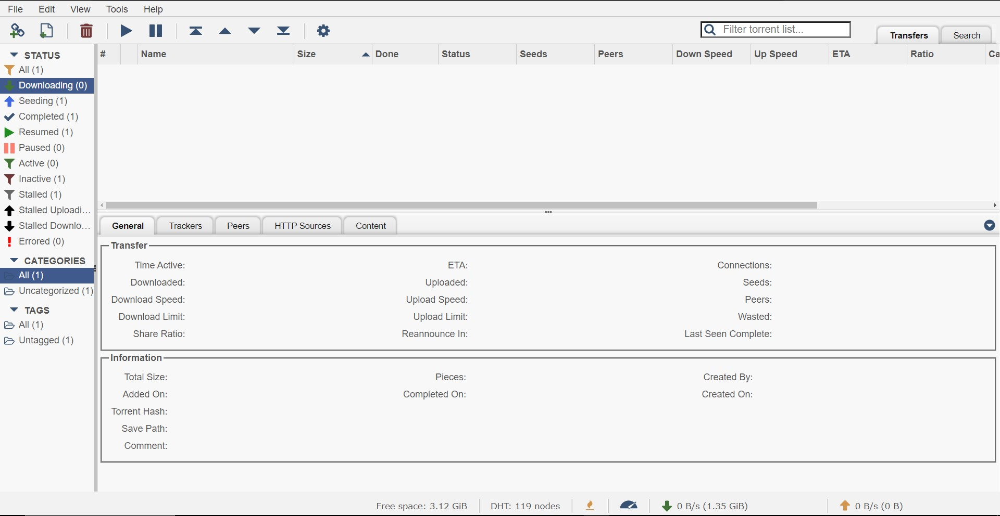
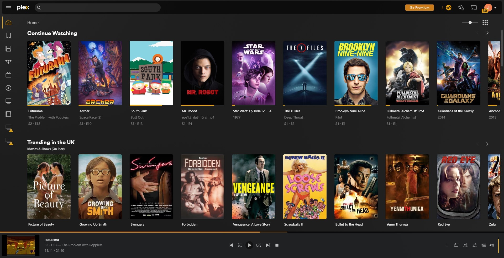
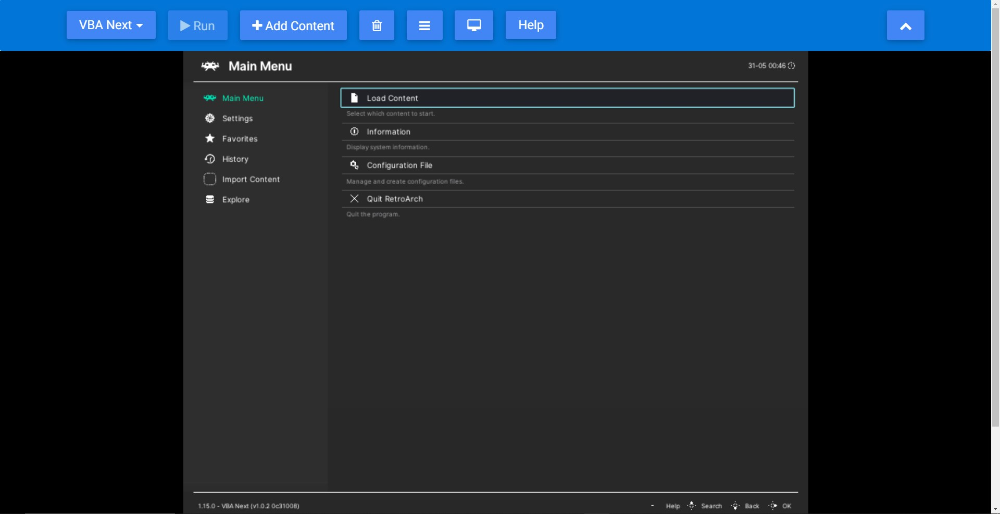
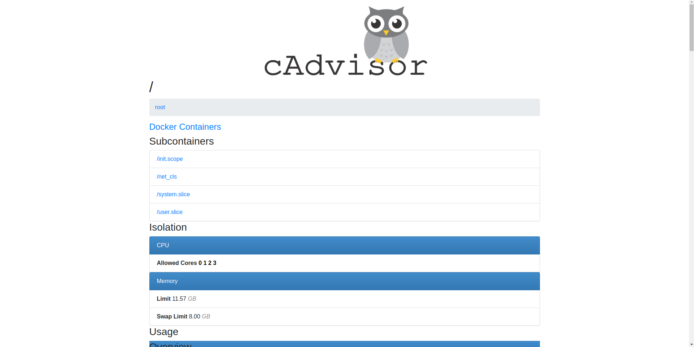
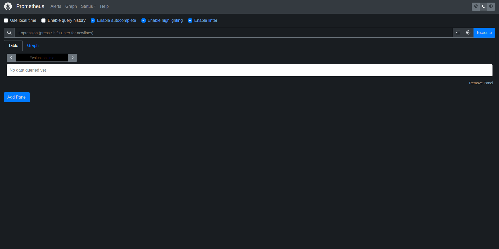
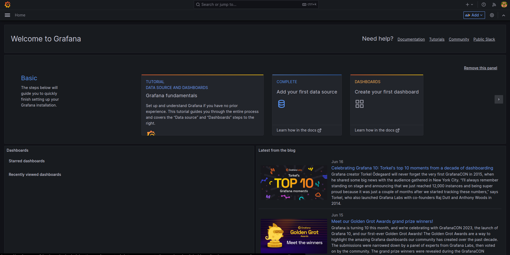

# Docker Media Server version-0.2.1
Welcome to the Docker Media Server repository! This project aims to provide a comprehensive media server solution that brings together on-demand videos, games, a cloud file server, and a monitoring backend.  

Whether you're looking to set up your own personal streaming service, organize and access your media collection, or securely store and share files in the cloud, this media server has got you covered. With an array of components and features, such as Twingate for secure remote access, a reverse proxy for seamless connections, and popular tools like Plex, Retroarch, and Owncloud, this media server offers a versatile and user-friendly environment.  

Additionally, it includes ClamAV for malware protection and Metrics for monitoring system performance. This repository provides detailed documentation on system requirements, a quick start guide, usage instructions, and different distribution options to suit your needs. Get started and transform your Docker environment into a powerful media server today!  

Note: some of the ancillary functions are not in a working state. Those functions are:  
reverse_proxy, index_page and swarm
They will be functional by version 2.2

 

# Table of contents

- [Docker Media Server version-0.2.1](#docker-media-server-version-021)
- [Components & Features](#components--features)
  - [Twingate](#twingate)
  - [Reverse Proxy](#reverse-proxy)
  - [Index](#index)
  - [Jackett](#jackett)
  - [Qbittorrent + Wireguard](#qbittorrent--wireguard)
  - [Plex](#plex)
  - [Retroarch](#retroarch)
  - [Owncloud](#owncloud)
  - [ClamAv](#clamav)
  - [Metrics](#metrics)
- [System Requirements](#system-requirements)
  - [Recomended](#recomended)
  - [Basic](#basic)
  - [Swarm node](#swarm-node)
- [Quickstart](#quickstart)
- [Getting Started](#getting-started)
  - [WSL - Windows only](#wsl---windows-only)
  - [Docker - Required](#docker---required)
  - [Twingate account - Optional](#twingate-account---optional)
  - [VPN provider with support for p2p - Optional](#vpn-provider-with-support-for-p2p---optional)
- [Configuration](#configuration)
- [Building](#building)
  - [Scaling & Redundancy](#scaling--redundancy)
  - [Maintainence & Monitoring](#maintainence--monitoring)
- [Variations](#variations)
  - [Lite / Swarm Node](#lite--swarm-node)
  - [Base / Swarm Manager](#base--swarm-manager)
  - [Full / Compose Cluster](#full--compose-cluster)

 

# Components & Features

Listed below are the components and their features

 

## Twingate
Routes external hosts to internal addresses.  
A secure remote access solution that enables organizations to easily deploy and manage access controls for Docker containers. By leveraging Twingate's Zero Trust Network as a Service (NaaS) platform, Docker containers can be securely accessed and connected to authorized users and networks. Twingate for Docker provides a seamless and encrypted connection between remote users and Docker containers, eliminating the need for complex VPN setups. It offers granular access controls, allowing administrators to define specific permissions for different containers and users, ensuring a strong security posture. With Twingate for Docker, organizations can enhance the flexibility and security of their containerized applications, enabling remote teams to access and work with Docker containers securely from anywhere.

Twingate requires an account and authentication keys to be set up. It takes 5 to 10 minutes and its free. With twingate you can access servoces over the internet with a url and optional port i.e. postgres.int:5432  

 

## Reverse Proxy
Routes URL requests to internal hosts & ports. allowing you to access services via urls i.e. www.dockernet.com/jackett  

A server that acts as an intermediary between client devices and backend servers. It receives client requests and forwards them to the appropriate backend server, serving as a central point of control and handling tasks such as load balancing, caching, and SSL termination. By sitting between clients and servers, the NGINX reverse proxy can enhance performance, improve security, and simplify the management of multiple backend services. It can distribute incoming requests across multiple servers to distribute the workload, cache frequently accessed content to reduce server load, and terminate SSL/TLS connections to offload the decryption process from backend servers. Overall, an NGINX reverse proxy plays a crucial role in optimizing traffic flow, improving scalability, and providing flexibility in managing web applications and services.

 

## Index
The index page of our media server serves as a dynamic and user-friendly web server, acting as a landing page, service index, and metrics monitor all in one. With an intuitive menu interface, it conveniently displays and loads the available services within the Docker network, providing direct links and addresses to access each service. The unique feature of loading services on the same page allows for seamless navigation and effortless switching between services. This index page enhances the overall user experience, making it easy to explore and utilize the various media server functionalities with just a few clicks. Say goodbye to complex navigation and hello to streamlined service accessibility!

 

## Jackett

Torrent meta search.
Jackett works as a proxy server for torrent information: it translates queries from apps (Sonarr, Radarr, SickRage, CouchPotato, Mylar3, Lidarr, DuckieTV, qBittorrent, Nefarious etc.) into tracker-site-specific http queries, parses the html or json response, and then sends results back to the requesting software. This allows for getting recent uploads (like RSS) and performing searches.  

[Jackett](https://github.com/Jackett/Jackett)

 

## Qbittorrent + Wireguard

Torrent manager with web UI and VPN and internet kill switch.
This implementation of qBittorrent enhances the popular torrent manager with a web UI, offering a seamless and user-friendly experience. Built upon the foundation of qBittorrent, a bittorrent client programmed in C++/Qt that utilizes libtorrent (also known as libtorrent-rasterbar) by Arvid Norberg, this implementation stands out by integrating a VPN service with support for both WireGuard and OpenVPN. This addition provides an extra layer of privacy and security for your torrenting activities. In addition to its robust functionality, this version of qBittorrent retains the qualities that make it a compelling alternative to other bittorrent clients, such as speed, stability, Unicode support, and a wide range of features. With this implementation, you can enjoy the benefits of a powerful torrent manager while maintaining your online privacy and security through the seamless integration of the VPN service.  

[qbittorrentvpn - DyonR](https://github.com/DyonR/docker-qbittorrentvpn)

 

## Plex

Media server, web UI and web based player. 

Plex is a powerful media server that organizes and streams your personal media collection across multiple devices. With an intuitive interface and automatic metadata retrieval, Plex allows you to enjoy your movies, TV shows, music, and photos with ease. It offers transcoding capabilities for smooth playback on any device, robust sharing options, integration with online content, and customization features. Plex turns your media server into a personalized streaming service, accessible from anywhere, and provides a seamless viewing experience across platforms.  

Plex requires an account to be used, access the web interface and you will be guided through the process.   
It is advisable to setup remote connection to plex in the settings if you intend to access the server remotely.  

[docker-plex - Linuxserver.io](https://github.com/linuxserver/docker-plex)

 

## Retroarch

Web browser based video game emulation.  

RetroArch Web is a web-based version of the popular open-source emulator frontend, RetroArch. It allows you to play a wide variety of retro games directly in your web browser, without the need for any additional software or installation. RetroArch Web leverages the power of web technologies such as HTML5 and JavaScript to provide a seamless and accessible gaming experience. It supports multiple platforms and emulators, allowing you to enjoy games from various consoles and systems. With RetroArch Web, you can relive the nostalgia of classic games and conveniently access your gaming library from any device with a compatible web browser. Whether you're a seasoned retro gaming enthusiast or a casual player, RetroArch Web offers a convenient and user-friendly way to enjoy retro gaming on the web.

Notes:
N64 cores are not in a working state at the current time. There are specific web-based emulators for the N64 that could be added to this compose.
I have tested all GB, GBC, GBA, NES, SNES, MD/MS and N64 cores, only the N64 does not work.
There are sometimes performance issues, especially when the container/core has first loaded, this could be improved by handing the container more resources to begin with.

[Retroarch Web - Inglebard](https://github.com/Inglebard/dockerfiles/tree/retroarch-web)

 

## Owncloud  

A self hosted cloud and file management interface.  

ownCloud is a powerful and versatile open-source file synchronization and sharing platform. It provides individuals and organizations with a secure and self-hosted cloud storage solution. With ownCloud, you can easily store, access, and share files and folders across multiple devices and platforms. It offers features such as file versioning, collaborative editing, and sharing permissions, giving you full control over your data and how it is shared. ownCloud also prioritizes data privacy and security, offering end-to-end encryption options and the ability to integrate with existing authentication systems. Furthermore, ownCloud supports a wide range of third-party applications and plugins, allowing you to extend its functionality to meet your specific needs. Whether you're an individual looking for a personal cloud storage solution or a business in need of a secure file sharing platform, ownCloud provides a flexible and customizable solution for your data management needs.
[Owncloud docker server - Owncloud](https://github.com/owncloud-docker/server)

 

## ClamAv
Periodically scans shared folders for known threats.  

ClamAV is an open-source antivirus software designed to detect and protect against various types of malware, including viruses, trojans, worms, and other malicious software. It provides a robust and reliable scanning engine. ClamAV offers command-line tools, a scanning daemon, and a library for third-party software integration, making it flexible and versatile. It uses a signature-based detection approach, comparing files against an extensive database of known malware signatures. Additionally, ClamAV employs heuristics and behavioral analysis techniques to detect new and emerging threats. With regular updates to its signature database, ClamAV ensures effective detection and protection against evolving malware threats. It is widely used in email gateways, file servers, web servers, and other systems where malware scanning is crucial for security. ClamAV provides a valuable layer of defense against malware, helping to safeguard your systems and networks from potential threats.

 

## Metrics

### cAdvisor

cAdvisor (short for Container Advisor) is an open-source monitoring and performance analysis tool specifically designed for containerized environments.  
It provides a comprehensive view of resource usage and performance metrics for individual containers running within a cluster. cAdvisor collects real-time data on CPU usage, memory consumption, network activity, disk I/O, and other key metrics, allowing administrators and developers to gain insights into container performance and troubleshoot issues. With its intuitive web interface and API, cAdvisor offers easy integration with container orchestration systems like Kubernetes, making it a valuable tool for monitoring and optimizing containerized applications.

 

### Prometheus

Prometheus is an open-source monitoring and alerting toolkit designed for containerized and cloud-native environments.   
It serves as a powerful data collection and storage system that enables the collection, aggregation, and analysis of time-series metrics. Prometheus is often used in conjunction with other tools like cAdvisor and Grafana to create a comprehensive monitoring stack. In this stack, cAdvisor collects performance metrics from individual containers and exposes them in a standardized format. Prometheus then scrapes and stores these metrics, allowing for long-term data retention and analysis. Grafana complements Prometheus by providing a visualization layer, allowing users to create interactive dashboards and gain meaningful insights from the collected metrics. Together, Prometheus, cAdvisor, and Grafana form a robust monitoring solution for containerized environments, enabling efficient resource utilization, performance monitoring, and troubleshooting.

 

### Grafana

Grafana is a popular open-source data visualization and monitoring tool that allows you to create dynamic and interactive dashboards for analyzing and exploring your metrics, logs, and time-series data.   
With Grafana, you can connect to various data sources such as databases, cloud services, and monitoring systems, and effortlessly visualize your data using a wide range of pre-built panels and graphs. It offers a user-friendly interface, extensive customization options, and supports a variety of visualization techniques, including charts, graphs, heatmaps, and tables. Grafana's intuitive query language and alerting capabilities enable you to gain valuable insights from your data and monitor the health and performance of your systems in real-time. Whether you need to monitor infrastructure, track application metrics, or create executive-level dashboards, Grafana provides a flexible and powerful solution for visualizing and analyzing your data.

 

# System Requirements

## Recomended
4 Core, 2.6Ghz processor  
16GB of RAM
## Basic
2 Core, 2Ghz processor  
8GB of RAM
## Swarm node
2 Core 2Ghz processor  
4gb of RAM

Swarm node require much less power as they can be handling as little as a single container

 

# Quickstart

### Configuration

If your familiar with docker here is a quickstart guide so you can test the features.

Open the .env.example file in the projects root directory. 

If your not using a vpn, set QBITTORRENTVPN to 'false' instead of 'true'. 
If you are using a vpn, drop your wiregaurd configuration file in qbittorrent/config/wireguard and ensure its named wg0.conf

If you would like to use twingate, include your endpoint keys (guide below) in the ACCESS_TOKEN & REFRESH_TOKEN variables, if not set TWINGATE to false.

Amend the directories variables to match those of your systems media files
FILES: The top level directory of your server
TORRENTS : Where torrent files are stored and exchanged between jackett and qbitorrent
DOWNLOADS: Where downloads are stored
CLOUD_FILES: Where cloud files are stored
GAMES: Games directory for retroarch
TV_SHOWS : Plex TV shows location
FILMS: Plex films location

### Build

Note any passwords and usernames in the env file as they are the defaults and will be needed later to access services. 
Then save the file as .env

The server can now be brought up with the docker command

     docker-compose up

### Access

Now type the following to see the services and their port numbers

  docker stats 

Access the service through a browser using 
  
  http://localhost:PORT_NUMBER

Replacing PORT_NUMBER with the port number of the service you would like to access

 

# Getting Started

 

## WSL - Windows only
WSL2 (Windows Subsytem for Linux 2) is a linux VM (Virtual Machine) that docker uses to run containers this must be installed for docker to function as expected

## Docker - Required
If you haven't installed docker on your machine visit the Docker website (https://www.docker.com/) and follow the instructions to install Docker for your operating system.
Docker Compose typically comes bundled with Docker, so you don't need to install it separately.

If you are using linux you need to add your user to the docker group using

  sudo groupadd docker
  sudo usermod -aG docker $USER
  newgrp docker

[Check here if you have issues](https://docs.docker.com/engine/install/linux-postinstall/)

 

## Twingate account - Optional

If you are not familiar with twingate and intend to use it, here are instructions on how to setup an account, a twingate network and how to connect the server to it.

### Visit the Twingate website:

Open a web browser and go to the Twingate [website](https://www.twingate.com/).
Sign up for an account:

Click on the "Get Started" or "Sign Up" button on the Twingate homepage.
Follow the registration process and provide the necessary information, such as your email address, name, and organization details.

### Set up your organization:

Upon logging in, you will be prompted to set up your organization.
Follow the on-screen instructions to configure your organization's name, domain, and other relevant details.

### Access the Admin Dashboard:

After setting up your organization, you will be taken to the Twingate Admin Dashboard.
The Admin Dashboard is where you can manage your organization's settings, users, and resources.

Navigate to the Connectors section:

In the Admin Dashboard, look for the "Connectors" tab or section.
Click on it to access the Connectors configuration.

### Add a new Connector:

To add a new Connector, click on the "Add Connector" or "New Connector" button.
Follow the prompts to configure the Connector's details, such as its name and connection type.
Twingate supports various types of Connectors, including Cloud Connectors, Network Connectors, and Identity Providers. Choose the appropriate type based on your requirements.

### Retrieve Connector details:

Once you have added a Connector, you will be provided with specific details required for its configuration.
You will need the authentication tokens.
Note down or copy the necessary Connector details as you will need them to configure the Connector on your network or system.

Configure the Connector:

With the Connector details in hand, 

 

## VPN provider with support for p2p - Optional

### Sign up for an account:
Visit the Mullvad website:

Open a web browser and go to the Mullvad website (https://mullvad.net/).

Click on the "Get started" or "Sign up" button on the Mullvad homepage.
Follow the registration process and provide the necessary information, such as your email address and desired account details.

### Choose a payment method:

Mullvad offers various payment options, including credit cards, PayPal, cryptocurrencies, and more.
Select the payment method that suits you best and follow the instructions to complete the payment process.

### Generate a WireGuard configuration file:

After logging in, navigate to the "Account" or "Settings" section of the Mullvad app.
Look for an option to generate a WireGuard configuration file.
Click on the "Generate" or "Download" button to create and download the WireGuard configuration file.

### Save the WireGuard configuration file:

Choose a location on your device where you want to save the WireGuard configuration file.
It is typically a .conf file or a file with a .conf extension.
Make sure to remember the location where you save the file for later use.

### Set up Qbittorrent using the configuration file:

 

# Configuration

Configuration is achieved through the .env file here you can set usernames, passwords, ports, directories and other key build info. 
To start configuration save a copy of .env.example as .env and open it for editing. 

Open the .env.example file in the projects root directory. 

If your not using a vpn, set QBITTORRENTVPN to 'false' instead of 'true'. 
If you are using a vpn, drop your wiregaurd configuration file in qbittorrent/config/wireguard and ensure its named wg0.conf

If you would like to use twingate, include your endpoint keys (guide below) in the ACCESS_TOKEN & REFRESH_TOKEN variables, if not set TWINGATE to false.

Directories must be set for your media locations. Amend the directories variables to match those of your systems media files
FILES: The top level directory of your server
TORRENTS : Where torrent files are stored and exchanged between jackett and qbitorrent
DOWNLOADS: Where downloads are stored
CLOUD_FILES: Where cloud files are stored
GAMES: Games directory for retroarch
TV_SHOWS : Plex TV shows location
FILMS: Plex films location

Ports should be left in their default state unless you understand what you are doing.

 

# Building

### Composing the stack

Open a terminal or command prompt:

Navigate to the directory where the Docker Compose file is located using the `cd` command.

    cd /your/path/to/docker-mediaServer

Replace /your/path/to/docker-mediaServer with the actual path to this repository.

To start the services defined in the Docker Compose file, run the following command:

     docker-compose up
   
Docker Compose will read the configuration file and start the containers according to the specified services.
You will see the output and logs from the containers in the terminal or command prompt.
Monitor the logs to ensure that the services are starting correctly and to debug any issues.
Press `Ctrl+C` to stop the running services. This will gracefully stop and remove the containers.
   
### Additional useful commands:

If you prefer to run the services in the background (detached mode), you can use the `-d` flag. 
This will stop the output from the container being displayed in the terminal:
   
     docker-compose up -d
   
To stop the running services without removing the containers, you can use the following command:

     docker-compose stop

   
If you need to start the services again after they have been stopped, use the following command:
   
     docker-compose start

If you would like to see running service you can type 
    
    docker container stats

You can also specify a specific service, or set of services, for many of these commands by appending their name, as it is defined in the compose file, to the command.  
Take qbittorrent and plex for an example:

    docker-compose up -d plex qbittorrent

Type the following in to a terminal for more help with docker-compose
    docker-compose --help 

 

## Scaling & Redundancy
The stack can be scaled in two ways. 
Single host redundancy where multiple mirrored containers start for each service on one host.

Multiple host redundancy with Docker Swarm where services and load can be distributed between multiple host machines. If you have a raspberry pi, you can make a swarm.

### Single-Host Redundancy
All containers can be built in multiples to create redundancy within the structure of the media server. Performance overhead is minimal, allowing for more robust connections to the containers. 

### Docker swarm
I have not implemented swarm functionality fully however i have made a quick script to allow the stack to be built on a swarm master node. As of version 0.2.0 this method of running the stack is not advised.

Use the docker_stack_deploy.py script to quickly deploy this stack to a swarm

  python docker_stack_deploy.py

The script will replace the environment variable placeholders in the compose file with their values from the .env and save the result to a file name docker-compose-swarm.yml. Be careful with the generated file as it will contain sensitive info such as passwords and private keys.

Ii have not implemented a way to start these services on a worker node but the swarm can be run over multiple managers. To start the stack on secondary managers copy or download docker -mediaserver to the target 
Start docker
Get the swarm key and network address including port number.
Join the swarm
Run the same script

### Service Redundancy

## Maintainence & Monitoring

# Variations
There are 3 versions of the compose, base, full and lite.

## Lite / Swarm Node
The lite image is generated using a script it can contain any combination of services and is used for deploying to nodes

## Base / Swarm Manager 
The base image contains all of the infrastructure for the rest of the containers
mariadb, redis, cadvisor, grafana and prometheus

## Full / Compose Cluster
The full image is every service defined in the master docker compose file.

##
 

